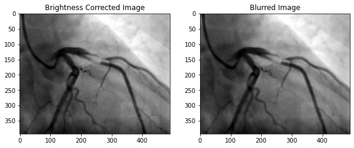
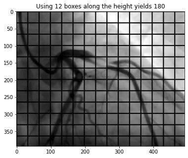
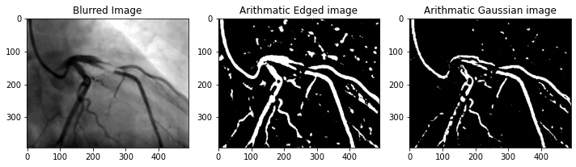
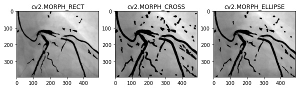
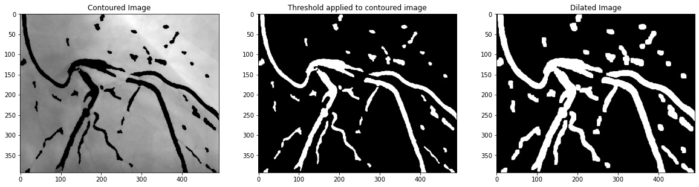

# Angiogram Blockage Detection | CPE-645-FinalProject

<p align="center" width="100%">
     
</p>

## Contributer
- Samuel Mohebban 
- [LinkedIn](https://www.linkedin.com/in/samuel-mohebban-b50732139/)
- [Medium](https://medium.com/@heeebsinc)

### Prompt
&nbsp;&nbsp;&nbsp;&nbsp;&nbsp;&nbsp;```Image segmentation has been one of the classical image processing techniques. 
It intends to abstract some important feature from an image based on its global and/or local amplitude distribution. 
One of the major application areas of this technique is medical imaging, where segmentation can automatically highlight the objects 
(e.g. vessel, cardiac chamber etc.) to help physicians diagnosing disease.```

&nbsp;&nbsp;&nbsp;&nbsp;&nbsp;&nbsp;```In this project, you are to apply image segmentation techniques to X-ray angiography, 
where X-ray images are taken when an X-ray absorbing substance is injected into the patient's blood stream to produce contrast. 
The resulting X-ray images have dark regions representing the blood flow within vessels. Your system should be able to automatically 
locate any occlusion and follow the surrounding vessel wall to compute the ratio between the minimum and nominal vessel diameters. 
Such results are practically important in detecting coronary disease. Your system should also accept user input of occlusion locations 
and perform the same percent occlusion measurement in that particular area.```


### Data
- [Medpix](https://medpix.nlm.nih.gov/search?allen=false&allt=false&alli=true&query=angiography)
- Sample images used for testing can be found [here](sample-images)

### Reference Articles
- [Liang, Dongxue, et al. “Coronary Angiography Video Segmentation Method for Assisting Cardiovascular Disease Interventional Treatment.” BMC Medical Imaging, vol. 20, no. 1, 2020, doi:10.1186/s12880-020-00460-9.](https://bmcmedimaging.biomedcentral.com/articles/10.1186/s12880-020-00460-9)
- [Dehkordi, Maryam  Taghizadeh, et al. “Retraction: A Review of Coronary Vessel Segmentation Algorithms.” Journal of Medical Signals &amp; Sensors, vol. 9, no. 1, 2019, p. 76., doi:10.4103/2228-7477.253755.](https://www.ncbi.nlm.nih.gov/pmc/articles/PMC3317762/)
- [Sharma, Neeraj, et al. “Automated Medical Image Segmentation Techniques.” Journal of Medical Physics, vol. 35, no. 1, 2010, p. 3., doi:10.4103/0971-6203.58777. ](https://www.ncbi.nlm.nih.gov/pmc/articles/PMC2825001/)

### Abstract
&nbsp;&nbsp;&nbsp;&nbsp;&nbsp;&nbsp;```A coronary angiogram is a low-risk medical technique used to visualize blood vessels and arteries, and can be used to both diagnose and treat heart and blood vessel conditions. To conduct this procedure, a doctor first injects a dye into a patient’s blood vessel then takes many X-ray images of this same area. Because the dye is visible in an X-ray, the doctor can determine if there is blockage (cardiovascular disease) based on the occlusion seen 
throughout the blood vessels.  My goal for this project is to automate the process of examining these X-ray images by using a light-weight 
segmentation algorithm that can locate these areas of occlusion. ```

&nbsp;&nbsp;&nbsp;&nbsp;&nbsp;&nbsp;```In the current medical industry, segmentation is a popular procedure for 
processing medical imagery. These methods are used to provide computer-aided diagnosis (CAD) and locate possible regions of 
interest (ROIs) that would be important for examining a patient’s condition and/or symptoms.  However, the types of segmentation 
algorithms differ depending on their use case as each imaging system has its own limitations and specifications. For example, 
segmentation is found in common procedures such as MRIs, CT, and PET scans which use segmentation for performing amplitude 
segmentation based on histogram features, edge based segmentation, and region based segmentation (Sharma, 2010).  Typical 
segmentation methods utilize a threshold that is used to compare to each pixel.  If a given pixel is lower than the threshold, 
that pixel is converted to 0 (black) while if it is higher, it is converted to 255 (white).  This can be performed in the 
opposite direction at the discretion of the operator. ```

<p align="center" width="100%">
     
</p>

### Description of work accomplished
To follow the code process, see [technical jupyter notebook](technical-notebook.ipynb)
The process consists of **10 steps**
1) **Load image into memory**

<p align="center" width="100%">
     
</p>

2) **Crop image borders by 10%**. In X-ray images, there often can be black/white borders around the image that would negatively impact this segmentation algorithm.  

<p align="center" width="100%">
     
</p>

3) **Convert cropped image to gray scale (1-dimensional)**

<p align="center" width="100%">
     
</p>

4) **Apply brightness correction to the gray scaled image**.  This will ensure that the distributions among pixel amplitudes is normalized.  
Function [_automatic_brightness_and_contrast](program.py) works by: 
   1) Calculating the cumulative distribution from the histogram of a gray scaled image

   2) Find the pixel value with the max number of pixels, and clip it with `clip_hist_percent = 1`

   3) Split the clipped histogram into two parts (1) left = values below `clip_hist_percent` and (2) right = values above `clip_hist_percent`

   4) Calculate alpha and beta values

   `alpha = 255 / (maximum_gray - minimum_gray)`

   `beta = -minimum_gray * alpha`

   5) Retrieve final scaled values using 

   `auto_result = cv2.convertScaleAbs(image, alpha=alpha, beta=beta)`

<p align="center" width="100%">
     
</p>

5) **Blur the image**.  This step will reduce noise around the image and allow for better segmentation
   - **Median Blur** is a commonly used method for reducing salt and pepper noise.  
   - To apply a median blur, you first determine a _**kernel size**_.  In this project, I used a kernel size of 5.  The kernel size is used to determine the number of neighbors that will be incorporated in the blur method.
     - ```cv2.medianBlur(image, ksize = 5)```

   - For example, with a neighborhood size of 5x5, 25 pixels will be used to calculate the median of all pixels. 
   - After gathering the median value, the center pixel in that 5x5 area will become that median value.  
   - The reason this method is so useful for salt and pepper noise is because the center pixel will _always_ be replaced with a pixel that is in the original image- as using the median calculation is more robust to outliers than compared to using an average or gaussian blur method.   

<p align="center" width="100%">
     
</p>

6) **Create `blockSize` using 12 boxes along the height of the image**
- This process involves separating the image into equal partitions so that there are a specific number of blocks along the y-axis. In this project, I ensured that there are 12 blocks along the height of the image. 
- Because each block is created around a central pixel, the blockSize of an image must be an odd number and each block must have square dimensions.
- For example, if an image has a dimension of 491x393 (WxH) pixels and we wish to have 12 blocks along the y-axis (height), it will require each block to have a height and width of 33 pixels. Given the height and width of each block, we can divide the width of the image by 33 to determine how many boxes we can fit along the x-axis.   

```
height_boxes = 12
block_size = int(image_height / height_boxes) #int(393 / 12) = 32 (rounded down)
if block_size % 2 == 0: #this means it is even
    block_size += 1 #block size = 33

width_boxes = int(image_width / block_size) #int(491 / 33) = 14 (rounded down)
if width_boxes % 2 == 0: #this means it is even 
    width_boxes += 1

```

- The calculation used in [program.py](program.py) is dynamic, so these numbers are specific to the size of the image being processed
- This blockSize is utilized when applying adaptive threshold, where an algorithm will determine the best threshold based on values calculated within each of these blocks.  (Explanation for how this algorithm works is explained in the next step). 
<p align="center" width="100%">
     
</p>

7) **Apply adaptive thresholding using the block size calculated above**
- Here, I applied mean adaptive thresholding using a blockSize of 33 and a constant of 10
- When applying adaptive thresholding, you have the option of using _**Arithmetic**_ or _**Gaussian**_ mean for calculating the threshold within each image.  In this project, I used Arithmetic mean (`cv2.ADAPTIVE_THRESH_MEAN_C`) as I believe Gaussian mean is not a good method for this application.  In Gaussian mean (`cv2.ADAPTIVE_THRESH_GAUSSIAN_C`), the _**weighted**_ average is performed so that the central pixel of the block contributes more weight to the average. In the [example image](readme-assets/steps/step7.jpg) below cell below, we can see that Gaussian mean reduces noise present in the image, however, it does not preserve the integrity of the vessels as well as arithmetic mean.  

`cv.ADAPTIVE_THRESH_MEAN_C`: The threshold value is the mean of the neighbourhood area minus the constant C.

`cv.ADAPTIVE_THRESH_GAUSSIAN_C`: The threshold value is a gaussian-weighted sum of the neighbourhood values minus the constant C.

<p align="center" width="50%">
     
</p>

- The threshold for each block is calculated by taking the arithmetic mean of the blockSizexBlockSize and subtracting it by C (10).  In the example in the previous step, using 12 block rows yields a blockSize of 33.  Given this, we will take the arithmetic average pixel amplitude within each 33x33 block and subtract that average by 10 to determine the threshold for that specific block. As mentioned in the previous step, the blockSize will change based on the original image dimension so the match explained here applies _only_ to that image - however, the logic is the same. In the previous step, I obtained 12 block rows (y) and 15 block columns (x).  Therefore, there will be a total of 180 (12 * 15) thresholds that correspond to each partitioned area.  

<p align="center" width="50%">
     
</p>

- After determining the thresholds for each specific block, an algorithm is applied where each pixel in a particular block is converted to either 0 (black) or 255 (white) based on that block's calculated threshold. There are _**2 procedures**_ that are popular:

1) `cv2.THRESH_BINARY`: Each pixel greater than or equal to the threshold value will be converted to a defined max value (255) while every pixel below the threshold will be converted to 0 (black)

<p align="center" width="100%">
     
</p>

2) `cv2.THRESH_BINARY_INV`: Each pixel greater than or equal to the threshold value will be converted to 0 (black) while every pixel below the threshold will be converted to a defined max value (255)

<p align="center" width="100%">
     
</p>

- In this project, I used `cv2.THRESH_BINARY_INV` which converted every pixel above the threshold to black while converting pixels below the threshold to white (max value of 255).  The reason I did this is because the darker regions in the image are considered blood vessels and are the regions of interest.  Also, performing this conversion makes contour calculation easier to perform (explained in the next step)

```
threshold_img = cv2.adaptiveThreshold(original_image, 255, cv2.ADAPTIVE_THRESH_MEAN_C, cv2.THRESH_BINARY_INV, block_size, 10)
```


<p align="center" width="100%">
     
</p>

8) **Get contours of thresholded image**
   1) The contour algorithm involves these steps..
   2) After finding the contours, we will draw each of them on the original cropped image and fill them with a black color
   3) Filling it in black will allow us for further thresholding later on

<p align="center" width="100%">
     
</p>

9) **Perform another round of thresholding to include only the contoured areas above**.  After, conduct **dilation** to reduce the space between the contours
   1) The threshold used for this is..
   2) Dilation is the process of ..
   
<p align="center" width="100%">
     
</p>

10) **A final round of contour estimation**. Here, we will get the contours of the dilated image above.  These contours will be used to calculate the euclidean distance between each blood vessel. 
    1) If a contour (blood vessel) is within 10 pixels of another vessel, this area is considered a possible location of occlusion/blockage
    2) The contour distance formula is as follows..

<p align="center" width="100%">
     
</p>

## Running the program (Tested using Ubuntu 20.04)

1) Clone repository onto your local machine
   1) `git clone <repo url>`
2) Set up virtual environment (conda, etc.) [Recommended]
   1) Install Miniconda 
      1) `cd /tmp`
      2) `apt-get update && apt-get install wget -y && wget https://repo.anaconda.com/miniconda/Miniconda3-py39_4.10.3-Linux-x86_64.sh`
      3) `chmod +x Miniconda3-py39_4.10.3-Linux-x86_64.sh && ./Miniconda3-py39_4.10.3-Linux-x86_64.sh`
         1) Follow the steps prompted in the command line
      4) Restart terminal to initialize conda 
         1) You should now see `(base)` on the left of your new terminal session
      5) Create conda environment
         1) `conda create --name blockage-detection python=3.9`
         2) `conda activate blockage-detection`
            1) You should now see that `(base)` has changed to `blockage-detection`
3) Install necessary packages
   1) [conda] `pip install opencv-contrib-python matplotlib tqdm && conda install pyqt`
   2) [no virtual enviornment] `pip3 install opencv-contrib-python matplotlib tqdm PyQT5`
4) Gather images you wish to run inference on and place them in [sample-images](sample-images)
5) Run the program
   1) [conda] `python program.py`
   2) [no virtual environment] `python3 program.py`

#### Sample Output
1) Upon running [program.py](program.py) a command line prompt will get displayed asking if you wish to specify a region of interest
   1) This step is to determine if you want the algorithm to process the entire image or just a region of interest that you get to draw
   2) Press Y to draw the region of interest | Press N to let the algorithm process the entire image
   
<p align="center" width="100%">
     
</p>

2) If you pressed Y, a window will pop up displaying one of your images in the sample-images directory

3) Once the application is done iterating through the images inside [sample-images](sample-images), the output images will be saved in [output-images](output-images)
   1) The default configuration will save only the output image with the detection, however, if you want to every step of the process, change `save_all_steps` on the bottom of [program.py](program.py) to `True` 

<p align="center" width="100%">
     
</p>

#### Possible errors and how to fix them
1) `ImportError: libGL.so.1: cannot open shared object file: No such file or directory`
   1) This is an opencv package conflict, in order to fix it you must run `apt-get update && apt-get install ffmpeg libsm6 libxext6  -y`
2) Python version
   1) To check your python version, open a command line and run `python`
      1) If the version is < 3.0.0, then you must use `python3` to run the program
      2) run `python3 program.py` instead of `python program.py`
3) `no protocol specified
qt.qpa.xcb: could not connect to display :1
qt.qpa.plugin: Could not load the Qt platform plugin "xcb" in "/root/miniconda3/envs/blockage-detection/lib/python3.9/site-packages/cv2/qt/plugins" even though it was found.
This application failed to start because no Qt platform plugin could be initialized. Reinstalling the application may fix this problem.`
   1) This means you do not have pyqt installed.  
   2) If you are running conda outside of the container, `conda install pyqt`
   3) If you are not running a virtual environment, `pip3 install PyQt5`
4) If you are stuck on a different error and need assistance, create an issue on this repo and I will be sure to answer ASAP

### Future Directions
- experiment ridge detection, piece-wise normalization, Harris corner detection and the rolling algorithm
- use segmentation networks and other machine learning approached to generate similar or better results
- make the function [_find_if_close](program.py) for calculating the euclidean distance between two contours faster
- Test with images that are smaller than (500,500) without having to resize them to larger dimensions

